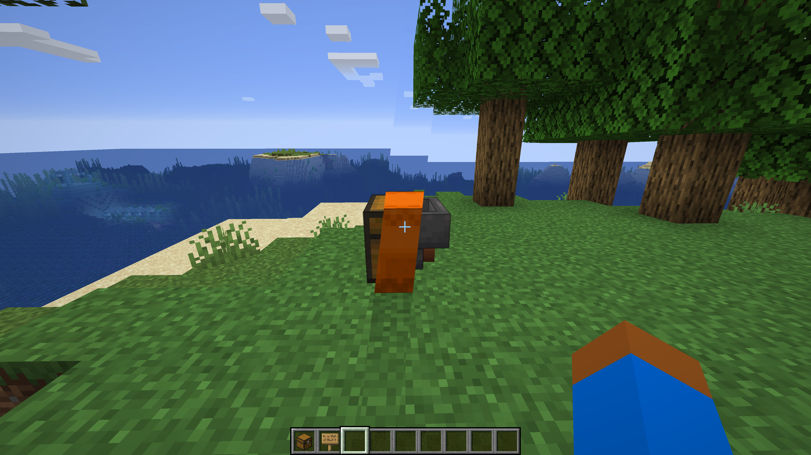
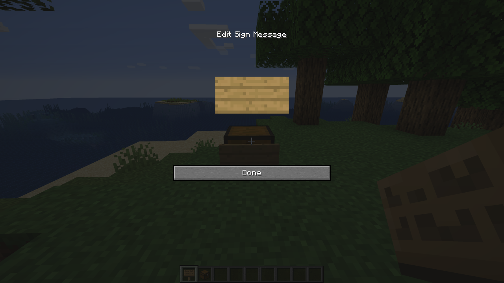
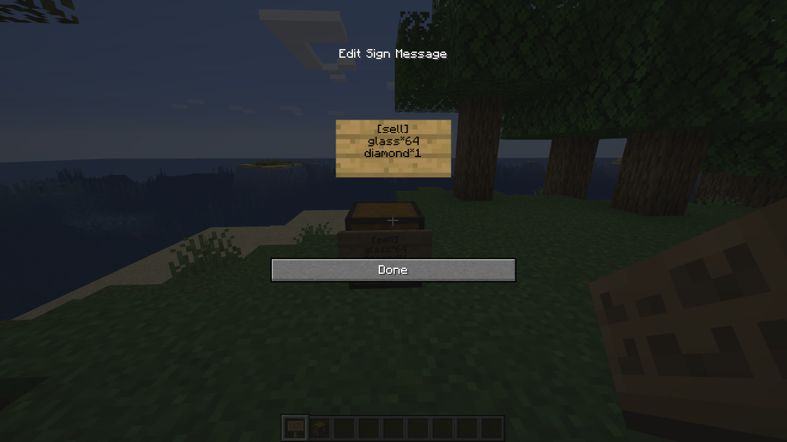
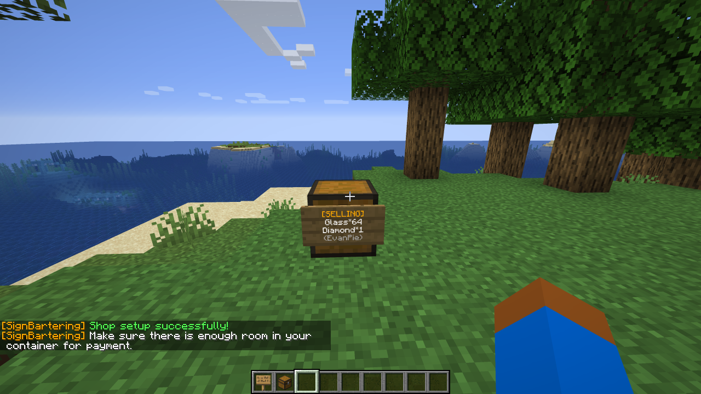
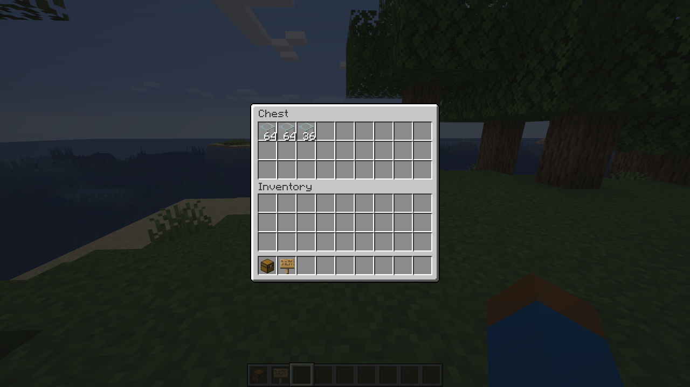
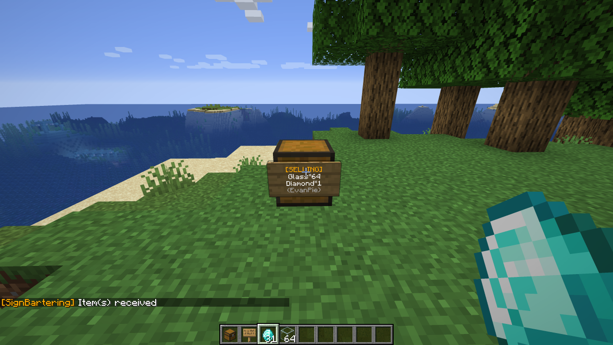
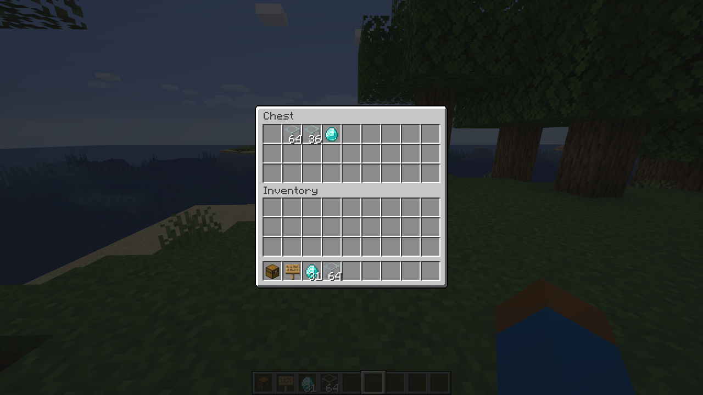

# SignBartering
A Minecraft plugin for simple, player-made sign shops.

## Usage

### Step 1 - Place any container (chest, shulker, hopper, etc.) down

### Step 2 - Place a sign on the container (shift+right click)

### Step 3 - Type as follows (the formatting is extremely important; notice the asterisks *):

**Line 1:** `[sell]` / `[free]` / `[isell] (op only)`  
**Line 2:** `what you are selling*how much of the item you are selling per purchase`  
**Line 3:** `what the payment item is*how much of the item`  
**Line 4:** `leave blank (the plugin will fill in your name automatically) - if using [isell], you can put a custom message here`

### Step 4 - Click Done

### Step 5 - Place the item you are selling in the container, **leaving enough room for payment**

### Step 6 - Anyone can now right click the sign with enough payment to purchase from your shop!

### Step 7 - The items in your container will get automatically removed and placed in the buyer's inventory, and their payment will be placed in the same container. This is why it is important that there is enough space in the container for payment. It is impossible to open the container of a shop you do not own.

